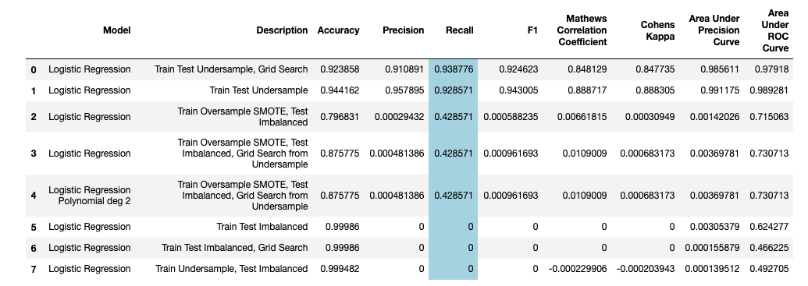
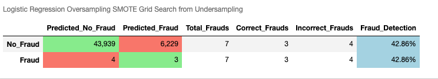
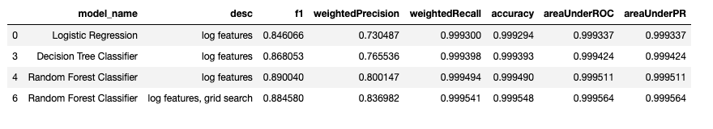

# Project Description
In this project I used the [Kaggle Creditcard Fraud](https://www.kaggle.com/mlg-ulb/creditcardfraud)
data to determine whether the transaction is fraud or not.

**Assumptions**:
- Here we have data for just two days, but we assume the data is representative
 of the whole population of credit card transactions.
- We assume the 28 variables V1-V28 are
obtained from correct method of PCA and are scaled properly.

**Metric Used**
- Here 1 means fraud and 0 means no fraud.
- The metric used is `Recall = TP / (TP + FN)` since we are interested in fraud case, not the overall accuracy of the model.

**Resampling Techniques**
- Under-sampling. (We have low number of frauds, choose randomly same number of non-frauds.)
- Oversampling `SMOTE` method. Used external library `imblearn`.

<h1 style="background-color:tomato;">Best Model So Far</h1>

| Model | Description | Accuracy | Precision | Recall | F1 | AUC |
| :---|:---|:---|:---|:---|:---|:---|
| catboost | default,seed=100 | 0.999403 | 0.999403 | 0.999403 | 0.999403 | 0.857090 |

 

<h1 style="background-color:tomato;">Undersampling</h1>

**Recall for all Classifiers with Grid Search for Undersampled Data**

 

<h1 style="background-color:tomato;">SMOTE Oversampling: Logistic Regression</h1>

 

<h1 style="background-color:tomato;">Anomaly Detection Methods</h1>

| Model | Description | Accuracy | Precision | Recall | F1(Weighted) |
| :---|:---|:---|:---|:---|:---|
| Isolation Forest | default | 0.997384 | 0.261682 | 0.285714 | 0.997442 |
| Local Outlier Factor | default | 0.996331 | 0.025641 | 0.030612 | 0.996493 |

 

<h1 style="background-color:tomato;">Gradient Boosting Modelling</h1>

| Model | Description | Accuracy | Precision | Recall | F1 | AUC |
| :---|:---|:---|:---|:---|:---|:---|
| lightgbm | grid search optuna | 0.999315 | 0.873418 | 0.704082 | 0.779661 | 0.851953 |
| lightgbm | default | 0.997367 | 0.275862 | 0.326531 | 0.299065 | 0.662527 |
| Xgboost | default, imbalanced | 0.999263 | 0.850000 | 0.693878 | 0.764045 | 0.846833 |
| Xgboost | default, undersampling | 0.999263 | 0.850000 | 0.693878 | 0.764045 | 0.846833 |
| Xgboost | n_estimators=150, imbalanced | 0.999263 | 0.850000 | 0.693878 | 0.764045 | 0.846833 |
| Xgboost | undersample, hpo1 | 0.999298 | 0.881579 | 0.683673 | 0.770115 | 0.841758 |
| Xgboost | imbalanced, hpo | 0.999245 | 0.898551 | 0.632653 | 0.742515 | 0.816265 |
| xgboost | grid search optuna | 0.999333 | 0.875000 | 0.714286 | 0.786517 | 0.857055 |
| catboost | default,seed=100 | 0.999403 | 0.999403 | 0.999403 | 0.999403 | 0.857090 |
| catboost | gridsearch optuna | 0.999368 | 0.930556 | 0.683673 | 0.788235 | 0.841793 |

 

<h1 style="background-color:tomato;">Automatic Modelling: pycaret</h1>

| Model | Description | Accuracy | AUC | Recall | Precision | F1 | Kappa |
| :---|:---|:---|:---|:---|:---|:---|:---|
| cb_tuned | fold=5 | 0.9996 | 0.9659 | 0.7865 | 0.9667 | 0.8642 | 0.8639 |
| lda_tuned | fold=5 | 0.9995 | 0.9833 | 0.7760 | 0.9217 | 0.8423 | 0.8420 |
| xgb | default | 0.9994 | 0.9585 | 0.7345 | 0.9102 | 0.8047 | 0.8044 |
| cb | default | 0.9995 | 0.9554 | 0.7345 | 0.9548 | 0.8215 | 0.8212 |
| lda | default | 0.9992 | 0.9677 | 0.7255 | 0.8340 | 0.7661 | 0.7657 |
| xgb_tuned | tuned | 0.9992 | 0.9677 | 0.7255 | 0.8340 | 0.7661 | 0.7657 |
| lda_tuned | n_iter=100,fold=10 | 0.9992 | 0.9677 | 0.7255 | 0.8340 | 0.7661 | 0.7657 |

 

<h1 style="background-color:tomato;">Big Data Modelling: PySpark</h1>

 

<h1 style="background-color:tomato;">Deep Learning Models</h1>

| Model | Description | Accuracy | Precision | Recall | F1 | AUC |
| :---|:---|:---|:---|:---|:---|:---|
|keras|class weight, bigger network|	0.983744	|0.081818	|0.826531	|0.148897	|0.905273|

# References
- https://www.tensorflow.org/tutorials/structured_data/imbalanced_data
- https://keras.io/examples/structured_data/imbalanced_classification/
- https://www.kaggle.com/residentmario/using-keras-models-with-scikit-learn-pipelines#
- https://machinelearningmastery.com/grid-search-hyperparameters-deep-learning-models-python-keras/
